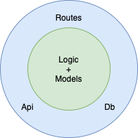

# Engelbyte's Waterbyte Clean Architecture
A software architecture style example for APIs that utilizes the features of SOLID-Principle.   
The example shows the API for Third-Party-Authentication with Google Account or Apple ID, storing and retrieving user data from a postgres database.

# Peripherals
## Package DB
Contains Database-specific code like creating the connection, executing queries and all other code that is specific to the DBMS chosen.

## Package Api
Contains code that queries external APIs for data.

# Core
## Business Logic (package Logic)
Contains **Testable** Business Logic. The methods provided usually have function parameters (Dependency Injection).

## Package Models
Contains entities used in Business Logic.

# Framework-Specific Code
## Package Routes
Contains framework-specific code (HTTP in the example). Each route is represented by a factory-function which takes in outer dependencies (function parameters) and returns a http request handler.   
Three responsibilities:
1. Parse framework-specific input into Business-Logic Models (Entities)
2. Use the entities created in Step 1 to call business methods
3. Present the results of calling the business methods in a framework-specific style.

# Main Package (server.go)
The main function that creates an HTTP-Server, registers all routes utilizing the factory-functions of the Route package.

# Dependency Diagram
